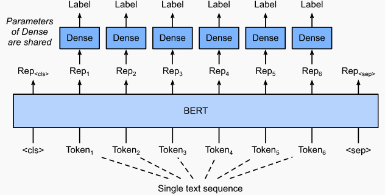

# Named Entity Recognition (NER)

## NER Model
NER is modelled as a token classification problem. The underlying BERT model is augmented
with classification heads for each token in a sequence:



Each token in a sequence must therefore carry a label.

## CoNLL Format
The Hugging Face format follows CoNLL-2003 conventions: Each token in a sequence is 
on a separate line along with its "B-" (**B**egin),  "I-" (**I**n),"O" (**O**utside) 
tag for the entity type.

In our corpus, we have suffixes GCPER (person) and GCORG 
(organization) and their abbreviations, further suffixed with "-ABBRV".

For example the sequence _The Director, DLA and the DLA shall:_ would be represented as
```
The O
Director B-GCPER
, I-GCPER
DLA I-GCPER
and O
the O
DLA I-GCORG-ABBRV
shall O
: O
<BLANK LINE>
```
Sequences are separated by a single new line. 

Note that _Director, DLA_ contains an abbreviation. In that context, it is _not_ labeled 
as "GCORG-ABBRV".

## Creating CoNLL Training Data
This is a multi-step process at the moment. We'll use DoDD, DoDI, and DoDM documents from the corpus as 
an example.

1. Create sentence `.csv` files. Run the CLI `src/text_classif/cli/raw_text2csv.py` with 
glob "DoD[DIM]*.json".This will write a `<doc-id>_sentences.csv` file, _e.g._, `DoDD_1000.20_sentences.csv` 
for each matching document, to a specified output directory.

2. We'll need a randomly chosen subset of the sentences, so first `cat` these files into one file, 
_e.g._, 
    ```
    cat *sentences.csv > your/output_path/big_sentence_file.csv
    ```
   
3. Next, shuffle and select *n* samples, _e.g._, 3,000 sentences:
    ```
    sort -R big_sentence_file.csv | head -3000 > rnd_3K_my_big_sentences.csv
    ```
   For the DoD[DIM] collection, this might take a few tens of seconds. If the file is very large,
   consider using `reservoir.py`.
   
4. `ner_training_data.py` uses the output of Step 3 to create `train`, `test`, and `val` datasets according
    the specified `--train-split`. The remainder will be evenly split into `test` and `val`:
    ```
    python ner_training_data.py \
        --sentence-csv rnd_3K_big_sentence_file.csv \
        --entity-csv path_to/gamechanger-ml/gamechangerml/src/entity/aux_data/flat_entities.csv \
        --separator space \
        --n-samples 0 \
        --train-split 0.80 
    ```
   A subset of sentences that contain one or more entities is first extracted.
   This subset is used to create three files, `train.txt.tmp`, `test.txt.tmp`, and `val.txt.tmp` 
   in CoNLL format.
   
## Training
The shell script `entity/bin/sample_run.sh`, run from `entity/bin`, sets up a small test using the
data in `tests/test_data`. 

It first runs `preprocessing.py` on each of the three files. This insures the number of tokens in 
the model-tokenized sentence is less than a maximum tokens (128). If not, it 
splits the sentence. This can be a slow process. If you know the sentences are within your limit or 
you're willing to tolerate some truncation, this step can be skipped. Simply change the file extension 
from `.txt.tmp` to `.txt`.

By default, the trained model will be saved in the data directory, `tests/test_data/model`. The `model`
directory will be created.

During training, you may see the warnings
```
/opt/conda/envs/gc-venv-blue/lib/python3.6/site-packages/torch/nn/parallel/_functions.py:64: UserWarning: Was asked to gather along dimension 0, but all input tensors were scalars; will instead unsqueeze and return a vector.
```
This is harmless and is fixed in later versions of `torch`.

## Metrics
Metrics are reported at the entity level excluding `O`. For example, with two sequences:
```
y_true = [['O', 'O', 'O', 'B-GCORG', 'I-GCORG', 'I-GCORG', 'O'], ['B-GCPER', 'I-GCPER', 'O']]
y_pred = [['O', 'O', ''B-GCORG', 'I-GCORG', 'I-GCORG', 'I-GCORG', 'O'], ['B-GCPER', 'I-GCPER', 'O']]

                       precision    recall  f1-score   support

              GCORG       0.00      0.00      0.00         1
              GCPER       1.00      1.00      1.00         1

          micro avg       0.50      0.50      0.50         2
          macro avg       0.50      0.50      0.50         2
       weighted avg       0.50      0.50      0.50         2

```