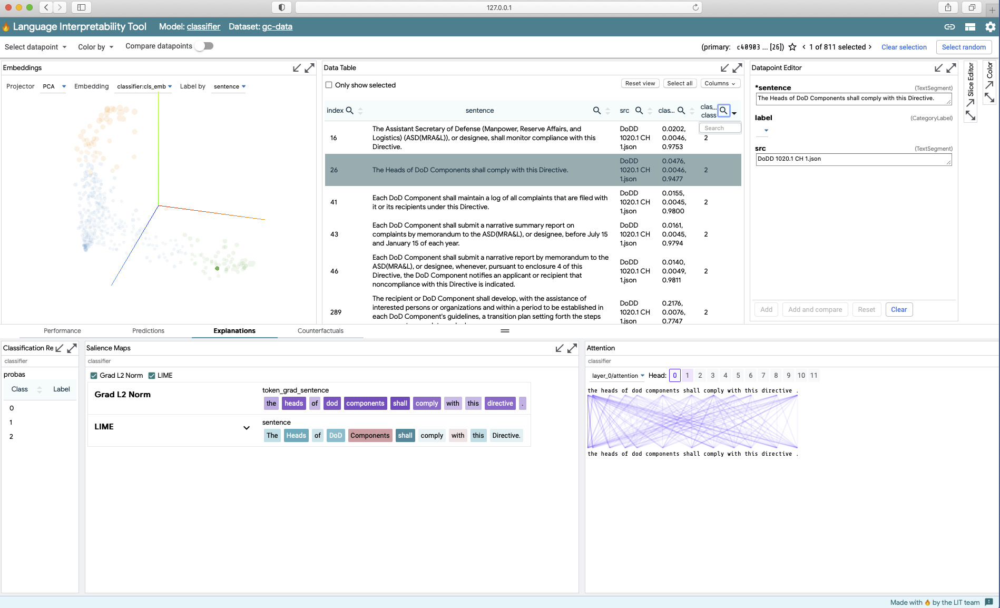

# `classifier-lit`
This package provides an implementation of the Language Interpretability Tool (LIT) for
a `pytorch` sequence classifiers.  Additional information on LIT can be 
found on [GitHub](https://pair-code.github.io/lit/). This was code assembled from various
examples in the LIT repository.

## Requirements
```
pip install absl-py==0.13.0
pip install lit-nlp==0.3 
```

## Model and Data
The implementation assumes you have a trained PyTorch classifier. 
The model directory should conform to the usual layout of PyTorch models. ClfLIT runs
prediction on a specified dataset.

The data is held in a `.csv` with columns
```
"src", "label", "sentence"
```
where `src` is a user-specific identifier, `sentence` is the text to be classified. The `label` column
is the expected classification label, i.e., a validation dataset. 
Expected labels are used to compute various metrics using the model's prediction.
If the expected labels are not known, a value of 0 can be used. The metrics will be meaningless, 
but the other features of LIT will work.

For the raw text in the GAMECHANGER corpus, the `.csv` files can be created 
using the CLI `text_classif/cli/raw_text2sentence_csv.py`. The output file uses the the
document name with spaces replaced by "_", suffixed with "sentences", e.g.,

```
DoDD_1000.20_sentences.csv
```

For the DoDD, DoDI, and DoDM documents, `classifier_data` has all the sentence `csv`s in
directories `dodd-sentences/`, `dodi-sentences/`, and `dodm-sentences`, respectively. 

## Starting the LIT Server

```bash
python classifier_lit.py \
    --model_path <model_directory> \
    --data_path <sentences.csv> \
    --num_labels 3 \
    --batch_size 8 \
    --max_seq_len 128 \
    --port 5432
```
After a short wait, you should see
```
I0604 16:10:49.734775 139835092129600 classifier_lit.py:75] model loaded
I0604 16:10:49.742584 139835092129600 gc_dataset.py:22] rows : 371
I0604 16:10:49.805324 139835092129600 dev_server.py:88]
 (    (
 )\ ) )\ )  *   )
(()/((()/(` )  /(
 /(_))/(_))( )(_))
(_)) (_)) (_(_())
| |  |_ _||_   _|
| |__ | |   | |
|____|___|  |_|


I0604 16:10:49.805436 139835092129600 dev_server.py:89] Starting ClfLIT server...
I0604 16:10:49.805539 139835092129600 caching.py:125] CachingModelWrapper 'distilbert': no cache path specified, not loading.
I0604 16:10:49.810200 139835092129600 gradient_maps.py:120] Skipping token_grad_sentence since embeddings field not found.
I0604 16:10:49.810353 139835092129600 gradient_maps.py:235] Skipping token_grad_sentence since embeddings field not found.
I0604 16:10:49.810859 139835092129600 wsgi_serving.py:43]

Starting Server on port 5432
You can navigate to 127.0.0.1:5432


I0604 16:10:49.811561 139835092129600 _internal.py:122]  * Running on http://127.0.0.1:5432/ (Press CTRL+C to quit)
``` 
In the browser you'll see something like




### Using a GPU
Inference on a even a moderate set of data can be computationally intensive. 
Typically, a cloud-based, headless GPU-instance is used. You can still
view results in your local browser: 

Use SSH with port forwarding to connect to the remote
```
ssh -i <access_creds> -L 5432:localhost:5432 <user_name>@<remote_ip_addr>
```
The code and data need to be on the remote. Data can be copied to the remote using `scp`
```
scp -i <access_creds> <filename.ext> <user_name>@<remote_ip_addr>:. 
```

Now, start the server on the remote (`classifier_lit.py`) and view the results in your 
local browser.