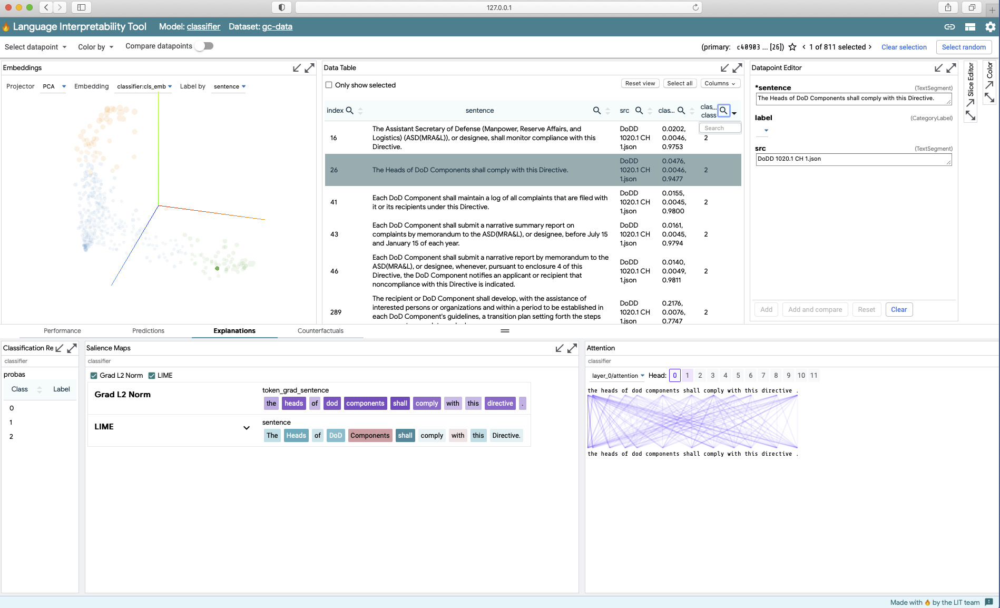

# `nlp-lit`
This package provides an implementation of the Language Interpretability Tool (LIT) for
a `pytorch` sentence classifier.

Further information on LIT can be found [here](https://pair-code.github.io/lit/).

## Getting Starting
Insure that the proper requirements are installed:
```
pip install -r requirements.txt
```
### Classifier Model
The implementation assumes a trained PyTorch classifier model with labels in `range(num_labels)`.

### Data File
The LIT server requires a `.csv` with columns 
```
"src", "label", "sentence"
```
where "src" is a user-specific identifier, "label" is a placeholder used by LIT, and "sentence" is the text to be classified.

## Starting the LIT Server
The shell script `bin/start_lit.sh` starts the server via the CLI
```
python nlp_lit/classifier_lit.py \
    --model_path ~/your_model_directory \
    --data_path ~/your_sentences.csv \
    --num_labels 3 \
    --batch_size 8 \
    --max_seq_len 128 \
    --port 5432
```
After a short wait, you should see
```
2021-06-04 16:10:25.256662: I tensorflow/stream_executor/platform/default/dso_loader.cc:49] Successfully opened dynamic library libcudart.so.11.0
I0604 16:10:49.734775 139835092129600 classifier_lit.py:75] model loaded
I0604 16:10:49.742584 139835092129600 gc_dataset.py:22] rows : 371
I0604 16:10:49.805324 139835092129600 dev_server.py:88]
 (    (
 )\ ) )\ )  *   )
(()/((()/(` )  /(
 /(_))/(_))( )(_))
(_)) (_)) (_(_())
| |  |_ _||_   _|
| |__ | |   | |
|____|___|  |_|


I0604 16:10:49.805436 139835092129600 dev_server.py:89] Starting LIT server...
I0604 16:10:49.805539 139835092129600 caching.py:125] CachingModelWrapper 'distilbert': no cache path specified, not loading.
I0604 16:10:49.810200 139835092129600 gradient_maps.py:120] Skipping token_grad_sentence since embeddings field not found.
I0604 16:10:49.810353 139835092129600 gradient_maps.py:235] Skipping token_grad_sentence since embeddings field not found.
I0604 16:10:49.810859 139835092129600 wsgi_serving.py:43]

Starting Server on port 5432
You can navigate to 127.0.0.1:5432


I0604 16:10:49.811561 139835092129600 _internal.py:122]  * Running on http://127.0.0.1:5432/ (Press CTRL+C to quit)
``` 
Point your browser to `127.0.0.1:5432`, with some configuration and selection:



### Port Forwarding
Inference on a even a moderate set of sentences can be computationally intensive and greatly benefits from
GPU assistance. To enable all this, you may need to use SSH with _port forwarding_, e.g.,
```
ssh -i access-creds.pem -L 5432:localhost:5432 <your id>@10.192.45.39
```
# License
MIT License Copyright (c) Chris Skiscim

Permission is hereby granted, free of charge, to any person obtaining a copy
of this software and associated documentation files (the "Software"), to deal
in the Software without restriction, including without limitation the rights
to use, copy, modify, merge, publish, distribute, sublicense, and/or sell
copies of the Software, and to permit persons to whom the Software is
furnished to do so, subject to the following conditions:

The above copyright notice and this permission notice shall be included in all
copies or substantial portions of the Software.

THE SOFTWARE IS PROVIDED "AS IS", WITHOUT WARRANTY OF ANY KIND, EXPRESS OR
IMPLIED, INCLUDING BUT NOT LIMITED TO THE WARRANTIES OF MERCHANTABILITY,
FITNESS FOR A PARTICULAR PURPOSE AND NONINFRINGEMENT. IN NO EVENT SHALL THE
AUTHORS OR COPYRIGHT HOLDERS BE LIABLE FOR ANY CLAIM, DAMAGES OR OTHER
LIABILITY, WHETHER IN AN ACTION OF CONTRACT, TORT OR OTHERWISE, ARISING FROM,
OUT OF OR IN CONNECTION WITH THE SOFTWARE OR THE USE OR OTHER DEALINGS IN THE
SOFTWARE